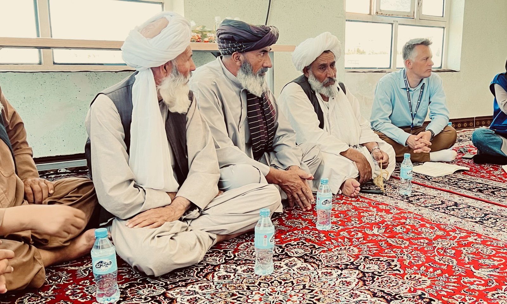
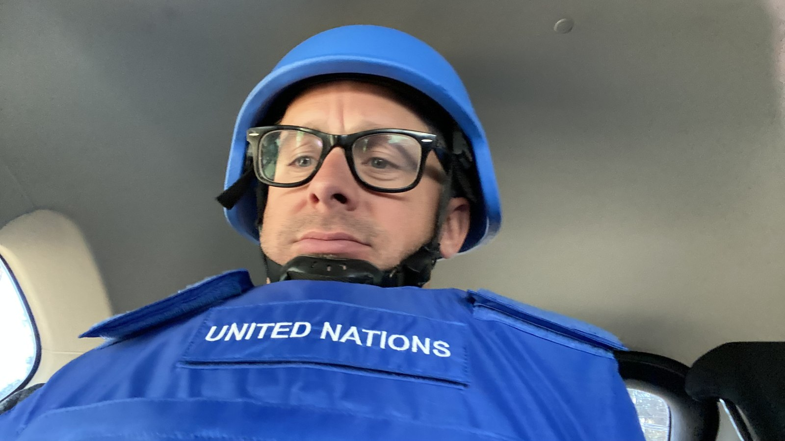

I am a political economist and senior United Nations official. For more than a decade I have worked at the center of some of the world's hardest problems: the Israeli-Palestinian conflict, the wars and transitions of the Arab region, the reunification talks in Cyprus, and the crises that followed upheaval in Iraq, Myanmar, and Afghanistan. I currently serve as senior economist for the UN development system in Kosovo — a return to the region where my career began nearly two decades ago, working on rule-of-law reform in post-war Pristina.

{.figure-img fig-alt="George Willcoxon seated with community elders during a consultation in Herat, Afghanistan"}

The through-line of that career is the use of serious analysis in high-stakes decisions. In Cyprus, I was the lead facilitator on economic power-sharing during the most intensive round of UN-led reunification talks in a generation. In Beirut, I developed risk assessment frameworks for a region in turmoil. In Jerusalem, I led the office supporting the UN's Middle East envoy and co-led the World Bank–UN–EU damage assessments for Gaza in 2021 and 2025. As a roving crisis officer, I helped UN country teams in Iraq, Myanmar, and Afghanistan rebuild their strategies after coups, takeovers, and transitions. The settings differ; the discipline is the same. Get the analysis right, say it clearly, and connect it to what decision-makers can actually do.

{.figure-img fig-alt="George Willcoxon in United Nations helmet and protective vest during security training"}

I am a quantitative social scientist by training and temperament. I hold a Ph.D. in political science and a master's in public policy from the University of California, Berkeley, and a B.A. from Princeton. I taught at Berkeley for twelve semesters. My published research spans peacebuilding, post-war recovery, security sector reform, and political economy. My current work applies machine-learning risk forecasting, macroeconomic modelling, and high-frequency data to development problems, including guidance on the responsible use of data, digitization, and artificial intelligence in development and humanitarian operations.

I grew up in Oakland and the East Bay, and after many years abroad I am again based in the San Francisco Bay Area. The views on this site are my own and do not necessarily reflect those of the United Nations.
