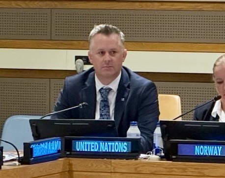

::: {style="float: right; width: 240px; margin: 0 0 1rem 1.5rem;"}
{fig-alt="George Willcoxon seated behind the United Nations nameplate at the Ad Hoc Liaison Committee meeting in New York" style="border-radius: 4px;"}
:::

A summary of my professional record follows. A full résumé is available for download: [Résumé (PDF)](files/Willcoxon-Resume.pdf).

::: {.role}
[Senior Development Coordination Officer & Economist]{.role-title} 
[United Nations, Kosovo · 2025–present]{.role-meta}

Senior economist for the UN development system in Kosovo. I lead socioeconomic analytics for the UN's senior-most development official in Pristina, advise on political and economic matters, and maintain partnerships with government counterparts, the international financial institutions, the European Union, and the diplomatic corps. Current projects include macroeconomic modelling, a high-frequency socioeconomic dashboard, small-area poverty estimation, and guidance on digitization, data, and AI in development programming.
:::

::: {.role}
[Head of the Resident Coordinator's Office / Chief of Coordination Unit]{.role-title} 
[UN Office of the Special Coordinator for the Middle East Peace Process, Jerusalem · 2024–2025]{.role-meta}

Led the integrated office supporting the Assistant Secretary-General in Jerusalem through a period of war and profound crisis, supervising a multinational team of twelve. Directed workstreams on political and economic analysis, strategic planning, communications, and partnerships; coordinated the engagement of 23 UN agencies; and co-led the 2025 World Bank–UN–EU Rapid Damage and Needs Assessment for Gaza and the West Bank.
:::

::: {.role}
[Senior Development Coordination Officer, Crisis Management]{.role-title} 
[UN Development Coordination Office, roving · 2022–2024]{.role-meta}

Deployed at short notice to UN Resident Coordinator offices in conflict and crisis settings. Facilitated the UN's strategic frameworks in Afghanistan and Myanmar and supported strategic planning and crisis response in Iraq and the Occupied Palestinian Territory.
:::

::: {.role}
[Development Coordination Officer & Economist]{.role-title} 
[UNSCO, Jerusalem · 2019–2022]{.role-meta}

Economic adviser within the office of the UN's Middle East envoy. Spearheaded major analytical products, including the UN's COVID-19 socioeconomic response plan for the Palestinian territory, and co-led the 2021 Gaza Rapid Damage and Needs Assessment with the World Bank and the European Union.
:::

::: {.role}
[Political Affairs Officer]{.role-title} 
[Office of the Special Adviser to the Secretary-General on Cyprus, Nicosia · 2016–2018]{.role-meta}

Lead facilitator on economic power-sharing during the most intensive round of UN-led reunification talks in a generation. Advised the Special Adviser's team in the negotiating room and served as focal point for the World Bank, the International Monetary Fund, and the European Commission.
:::

::: {.role}
[Economic Affairs Officer]{.role-title} 
[UN Economic and Social Commission for Western Asia, Beirut · 2015–2016; 2018–2019]{.role-meta}

Published institutional research on conflict, governance, and development in the Arab region; developed a regional risk assessment framework; and briefed senior UN officials on conflict dynamics across the Middle East and North Africa.
:::

::: {.role}
[Earlier career]{.role-title}

Political and conflict-risk consulting in Washington, D.C.; twice a Summer Associate at the RAND Corporation; editor of a handbook on terrorism and organized-crime law for the Kosovo Law Centre; and twelve semesters of teaching at UC Berkeley.
:::

::: {.role}
[Education]{.role-title}

Ph.D. in Political Science and Master of Public Policy, University of California, Berkeley. B.A. in Politics with honors, Princeton University.
:::
